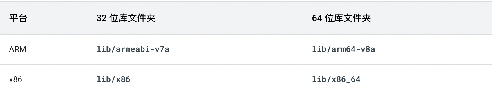
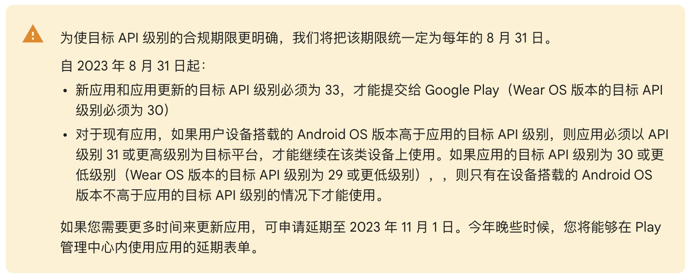

# Google Play - Android 开发政策

背景：Google Play 应用上架的限制和流程，可以说是 Android 开发应用的指南针，通过 Google Play的政策，可以看出 Android 开发的要求。


## 1、Google Play  64 位架构

2019 年 8 月 1 日，Google Play 上发布的应用必须支持 64 位架构。也就是上传到 Google Play ，必须上传2个版本。


[Google 支持 64 位架构](https://developer.android.com/distribute/best-practices/develop/64-bit?hl=zh-cn)




.png)

查看手机CPU架构

```
➜  ~ adb shell getprop ro.product.cpu.abi
arm64-v8a
```

## 2、Google Play  API 级别限制

[Google Play 政策说明](https://support.google.com/googleplay/android-developer/answer/11926878?hl=zh-Hans)

从 2023 年 8 月 31 日起，新应用和应用更新的目标 API 级别必须为 33（Android 13系统），才能提交给 Google Play（Wear OS 版本的目标 API 级别必须为 30），也就是开发者需要将 targetSdkVersion 最少设置为33。




## 3、Android App Bundles ： aab

- https://mp.weixin.qq.com/s/OBBrFQcK1UT1NfsEuBdq3A
- https://developer.android.com/guide/playcore/feature-delivery?hl=zh-cn