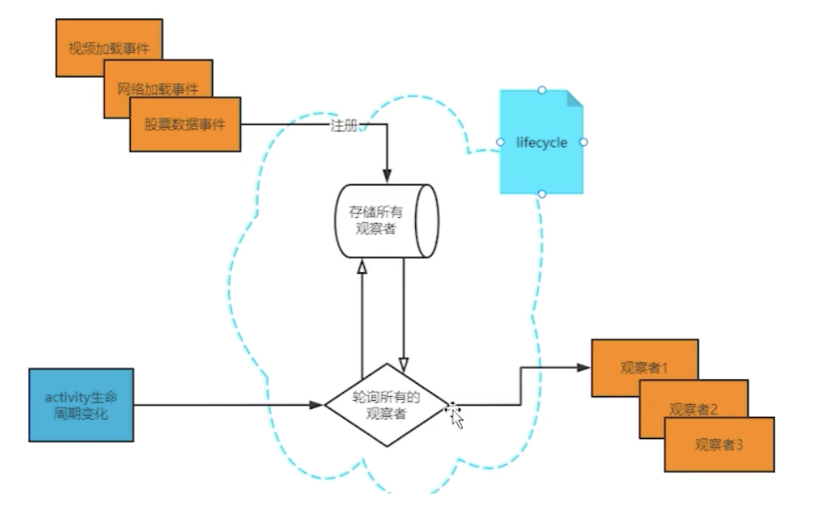
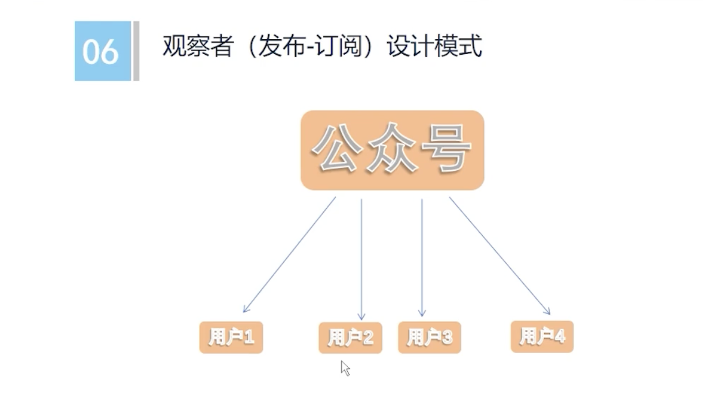

# Jetpack - Lifecycle 基础篇

## Lifecycle 简介

1. Lifecycle 的背景

2017 年 Google IO 大会上， 推出了 Lifecycle-Aware Components (生命 周期感知组件)，帮助开发者组织更好，更轻量，易于维护的代码。其中，生命周期管理库 (Lifecycles) 主要有三个组件构成，包括 Lifecycle、LiveData 和 ViewModel。Lifecycle 一般和ViewModel、LiveData结合使用。


在传统的 Android 开发中，开发人员需要手动管理应用程序组件的生命周期，这可能会导致错综复杂的代码和难以维护的应用程序。Jetpack lifecycle 提供了一个统一的方式来管理生命周期，使开发人员可以更好地组织和维护代码，从而提高应用程序的质量和可维护性。


2. Lifecycle 的定义

Lifecycle 是生命周期感知型组件可执行操作来响应另一个组件（如 activity 和 fragment）的生命周期状态的变化。

[Google 官方文档](https://developer.android.com/jetpack/androidx/releases/lifecycle?hl=zh-cn#declaring_dependencies)


3. Lifecycle 的作用

Lifecycle 主要通过观察者的设计模式实现的，当 Activity / Fragment 的生命周期发生变化的时候，就会通知观察者。所有有生命周期的个体，都可以用 Lifecycle 观察，不仅仅只有 Activity / Fragment 才有，只是 Android 系统 Activity / Fragment 默认接入了了Lifecycle 。Lifecycle 是基于状态机的变化，触发生命周期。


4. Lifecycle 的使用场景
   - 监听 Activity / Fragment / Service 的生命周期
   - 监听组件生命周期的各个回调





### 观察者设计模式

观察者和被观察者通过`addObserver`关联在一起

- 被观察者 ： Activity / Fragment，实现了 `LifecycleOwner`接口
- 观察者：任何地方，需要实现`LifecycleObserver`接口



## Lifecycle 使用

- 官方Demo ：https://github.com/android/architecture-components-samples
- Lifecycle 主要分为观察者和被观察者


### 1. 添加依赖

可以选择需要的添加依赖，最新版本可以查询官网：https://developer.android.com/jetpack/androidx/releases/lifecycle?hl=zh-cn#declaring_dependencies

```
    dependencies {
        val lifecycle_version = "2.5.1"
        val arch_version = "2.1.0"

        // ViewModel
        implementation("androidx.lifecycle:lifecycle-viewmodel-ktx:$lifecycle_version")
        // ViewModel utilities for Compose
        implementation("androidx.lifecycle:lifecycle-viewmodel-compose:$lifecycle_version")
        // LiveData
        implementation("androidx.lifecycle:lifecycle-livedata-ktx:$lifecycle_version")
        // Lifecycles only (without ViewModel or LiveData)
        implementation("androidx.lifecycle:lifecycle-runtime-ktx:$lifecycle_version")

        // Saved state module for ViewModel
        implementation("androidx.lifecycle:lifecycle-viewmodel-savedstate:$lifecycle_version")

        // Annotation processor
        kapt("androidx.lifecycle:lifecycle-compiler:$lifecycle_version")
        // alternately - if using Java8, use the following instead of lifecycle-compiler
        implementation("androidx.lifecycle:lifecycle-common-java8:$lifecycle_version")

        // optional - helpers for implementing LifecycleOwner in a Service
        implementation("androidx.lifecycle:lifecycle-service:$lifecycle_version")

        // optional - ProcessLifecycleOwner provides a lifecycle for the whole application process
        implementation("androidx.lifecycle:lifecycle-process:$lifecycle_version")

        // optional - ReactiveStreams support for LiveData
        implementation("androidx.lifecycle:lifecycle-reactivestreams-ktx:$lifecycle_version")

        // optional - Test helpers for LiveData
        testImplementation("androidx.arch.core:core-testing:$arch_version")

        // optional - Test helpers for Lifecycle runtime
        testImplementation ("androidx.lifecycle:lifecycle-runtime-testing:$lifecycle_version")
    }
```


### 2. 使用

本文以 Activity 为例。

#### 被观察者

这里的被观察就是指 Activity，通过 Activity 中的 lifecycle 可以添加观察者，监听生命周期。

```
class LifecycleActivity : AppCompatActivity() {
    override fun onCreate(savedInstanceState: Bundle?) {
        super.onCreate(savedInstanceState)
        setContentView(R.layout.activity_lifecycle)

				// 添加监听
        lifecycle.addObserver(LifeObserver1())
        lifecycle.addObserver(LifeObserver2())
        lifecycle.addObserver(LifeObserver3())
    }
}
```

#### 观察者

这里的观察者是指监听 Activity 的生命周期。有三种监听实现方式。


**方式一（官方弃用）**

通过注解的方式，监听每个生命周期

```
open class LifeObserver1 : LifecycleObserver {
    val TAG = "LifeObserver1"

    @OnLifecycleEvent(Lifecycle.Event.ON_CREATE)
    fun onCreate(owner: LifecycleOwner) { // 参数可有，可无
        Log.i(TAG, ">>>>> onCreate")
    }

    @OnLifecycleEvent(Lifecycle.Event.ON_START)
    fun onStart() {
        Log.i(TAG, ">>>>> onStart")
    }

    @OnLifecycleEvent(Lifecycle.Event.ON_RESUME)
    fun onResume() {
        Log.i(TAG, ">>>>> onResume")
    }

    @OnLifecycleEvent(Lifecycle.Event.ON_PAUSE)
    fun onPause() {
        Log.i(TAG, ">>>>> onPause")
    }

    @OnLifecycleEvent(Lifecycle.Event.ON_STOP)
    fun onStop() {
        Log.i(TAG, ">>>>> onStop")
    }

    @OnLifecycleEvent(Lifecycle.Event.ON_DESTROY)
    fun onDestroy() {
        Log.i(TAG, ">>>>> onDestroy")
    }
}
```


**方式二（推荐）**

```
class LifeObserver2 : LifecycleEventObserver {
    val TAG = "LifeObserver2"

    override fun onStateChanged(source: LifecycleOwner, event: Lifecycle.Event) {
        Log.i(TAG, ">>>>> ${event.name}")
    }
}
```


**方式三**

```
class LifeObserver3 : DefaultLifecycleObserver {
    val TAG = "LifeObserver3"

    override fun onCreate(owner: LifecycleOwner) {
        super.onCreate(owner)
        Log.i(TAG, ">>>>> onCreate")
    }

    override fun onStart(owner: LifecycleOwner) {
        super.onStart(owner)
        Log.i(TAG, ">>>>> onStart")
    }

    override fun onResume(owner: LifecycleOwner) {
        super.onResume(owner)
        Log.i(TAG, ">>>>> onResume")
    }

    override fun onPause(owner: LifecycleOwner) {
        super.onPause(owner)
        Log.i(TAG, ">>>>> onPause")
    }

    override fun onStop(owner: LifecycleOwner) {
        super.onStop(owner)
        Log.i(TAG, ">>>>> onStop")
    }

    override fun onDestroy(owner: LifecycleOwner) {
        super.onDestroy(owner)
        Log.i(TAG, ">>>>> onDestroy")
    }
}
```


### 3.  Activity 集成 Lifecycle

在 26.1.0 及更高版本中的 Fragment 和 Activity 已实现 [`LifecycleOwner`](https://developer.android.com/reference/androidx/lifecycle/LifecycleOwner?hl=zh-cn) 接口。那么如果直接继承 Activity 是没有集成 Lifecycle，需要手动集成。

```
class MyActivity : Activity(), LifecycleOwner {

    private lateinit var lifecycleRegistry: LifecycleRegistry

    override fun onCreate(savedInstanceState: Bundle?) {
        super.onCreate(savedInstanceState)

        lifecycleRegistry = LifecycleRegistry(this)
        lifecycleRegistry.markState(Lifecycle.State.CREATED)
    }

    public override fun onStart() {
        super.onStart()
        lifecycleRegistry.markState(Lifecycle.State.STARTED)
    }

    override fun getLifecycle(): Lifecycle {
        return lifecycleRegistry
    }
}
```


## Lifecycle 实战（定位）

这是官方提供的演示，用于 App 定位的时候，依据 Activity 的生命周期。[官方文档](https://developer.android.com/topic/libraries/architecture/lifecycle?hl=zh-cn)

**在没有使用 Lifecycle 的情况下，实现定位功能：**

```
internal class MyLocationListener(
        private val context: Context,
        private val callback: (Location) -> Unit
) {

    fun start() {
        // 开启定位
    }

    fun stop() {
        // 停止定位
    }
}

class MyActivity : AppCompatActivity() {
    private lateinit var myLocationListener: MyLocationListener

    override fun onCreate(...) {
        myLocationListener = MyLocationListener(this) { location ->
            // 获取到位置信息，更新 UI
        }
    }

    public override fun onStart() {
        super.onStart()
        Util.checkUserStatus { result ->
            // 如果在 activity 停止后调用此回调怎么办?
            if (result) {
                myLocationListener.start()
            }
        }
    }

    public override fun onStop() {
        super.onStop()
        myLocationListener.stop()
    }
}
```

这种实现方案的优缺点：

- Activity 销毁的时候，还在更新UI，导致 Crash
- Activity 中要复写各种生命周期的函数，业务过重
- 不能保证组件在 activity 或 fragment 停止之前就已启动


**使用 Lifecycle 实现定位功能：**

```
class MyActivity : AppCompatActivity() {
    private lateinit var myLocationListener: MyLocationListener

    override fun onCreate(...) {
        myLocationListener = MyLocationListener(this, lifecycle) { location ->
            // 更新 UI
        }
        Util.checkUserStatus { result ->
            if (result) {
                myLocationListener.enable()
            }
        }
    }
}
```


````
internal class MyLocationListener(
        private val context: Context,
        private val lifecycle: Lifecycle,
        private val callback: (Location) -> Unit
): DefaultLifecycleObserver {

    private var enabled = false

    override fun onStart(owner: LifecycleOwner) {
        if (enabled) {
            // 开启定位
        }
    }

    fun enable() {
        enabled = true
        if (lifecycle.currentState.isAtLeast(Lifecycle.State.STARTED)) {
            // 还没开启定位的时候，可以在这个时候开启
        }
    }

    override fun onStop(owner: LifecycleOwner) {
        // 停止定位
    }
}
````

这种实现方案的优缺点：

- 业务功能独立，避免 Activity 业务代码过重
- 可以通过 Lifecycle 获取 Activity 的状态，来决定是否开启

 
