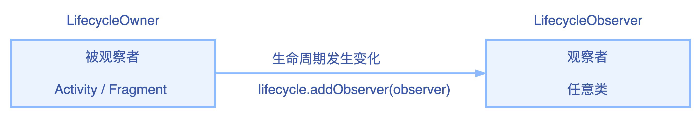
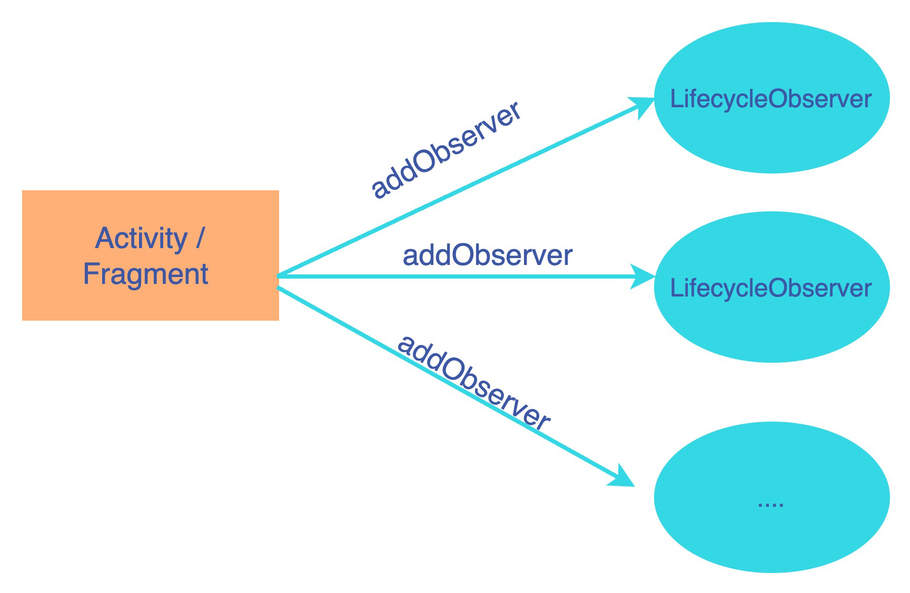
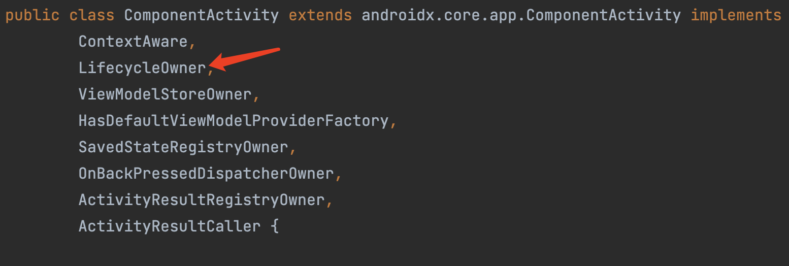

# Jetpack - Lifecycle 原理篇

本文涉及到的源码是：implementation("androidx.lifecycle:lifecycle-runtime-ktx:2.5.1")版本


## Lifecycle 的设计模式

Lifecycle 的设计思路主要使用了观察者设计模式。公众号就是典型的观察者设计模式，用户可以订阅自己喜欢的公众号，当公众号发表了文章，所有订阅的人都会收到通知。



Lifecycle 的设计模式：

- LifecycleOwner：被观察者实现此接口，通过  getLifecycle()  获取 Lifecycle，Lifecycle 通过 addObserver 添加观察者
- LifecycleObserver：观察者实现此接口，这是个空接口，用于标记这是观察者


被观察者可以有多个观察者



Lifecycle 源码：

```
public interface LifecycleOwner {
    @NonNull
    Lifecycle getLifecycle();
}


public interface LifecycleObserver {

}
```


实现`AppCompatActivity`类，默认就实现了 Lifecycle，因为`AppCompatActivity`的父类的父类`ComponentActivity`实现了被观察者`LifecycleOwner`接口.



## Lifecycle 的 States 和 Events

在 Lifecycle 类中，包含两个枚举类 State 和 Event。

```
    public enum State {
        DESTROYED,
        INITIALIZED,
        CREATED,
        STARTED,
        RESUMED;

        public boolean isAtLeast(@NonNull State state) {
            return compareTo(state) >= 0;
        }
    }
    
	public enum Event {
        ON_CREATE,
        ON_START,
        ON_RESUME,
        ON_PAUSE,
        ON_STOP,
        ON_DESTROY,
        ON_ANY;  
	}
```


State 和 Event 转换关系：

Lifecycle 是基于状态机的变化，触发生命周期，下图是构成 Android activity 生命周期的状态和事件


## Lifecycle 的实现原理

Lifecycle 的主要实现原理都是在 LifecycleRegistry 类中，Fragment 的生命周期则实现在 ReportFragment 里面。