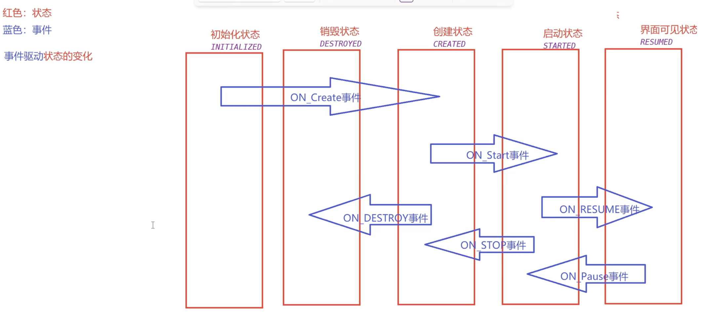
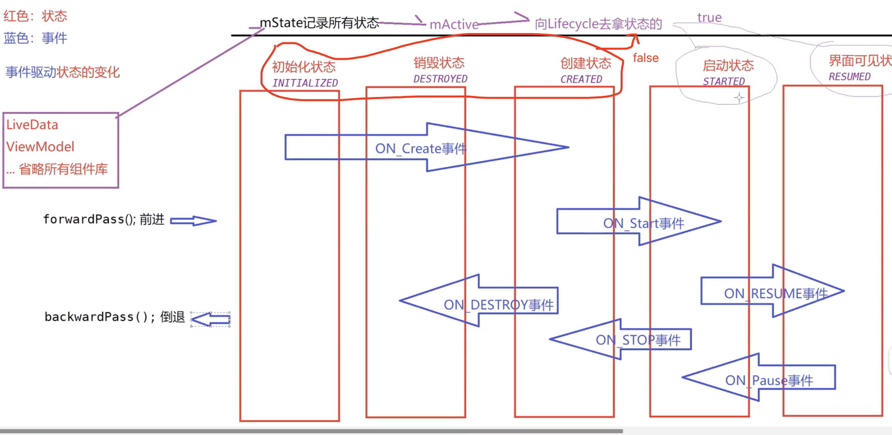
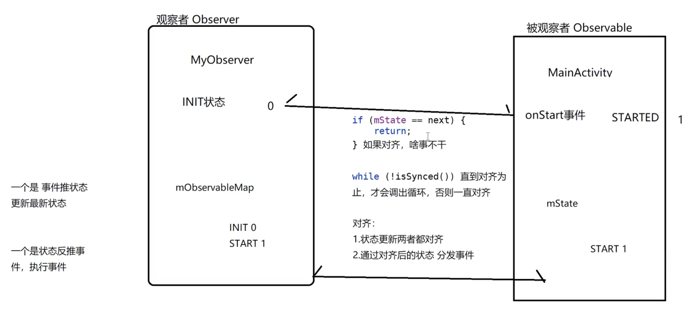
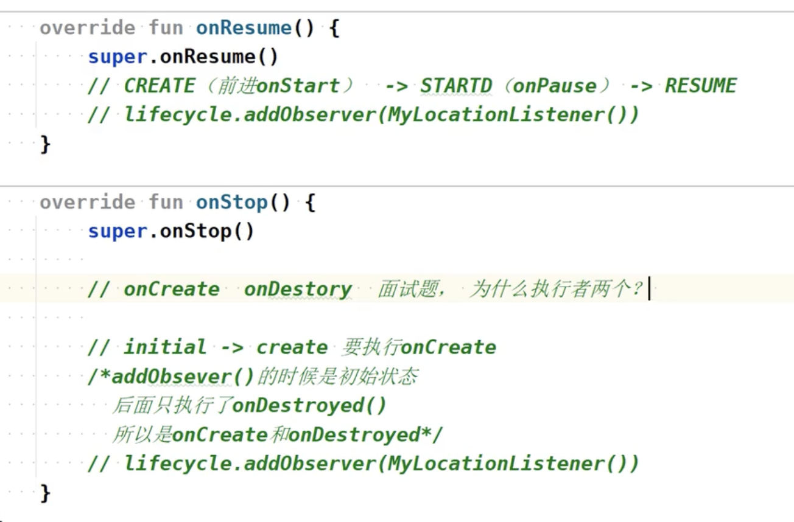
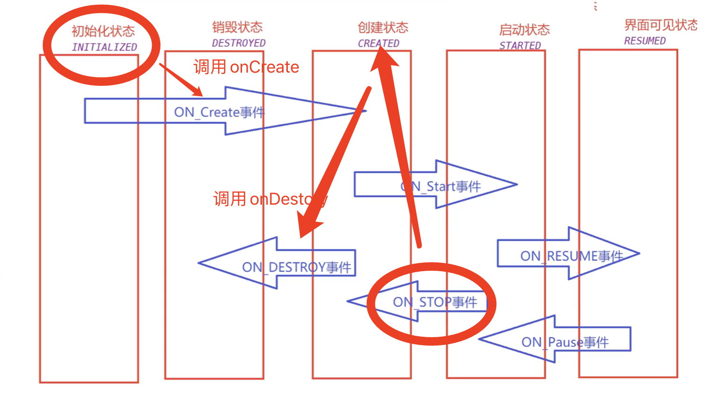
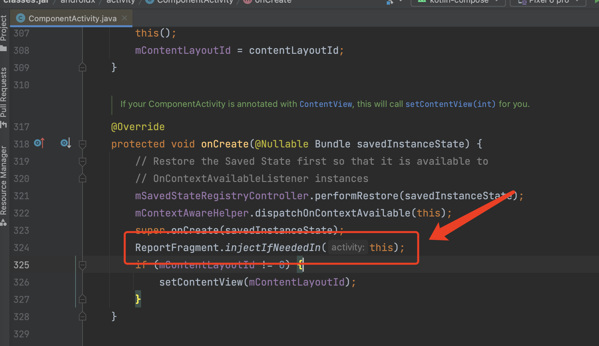
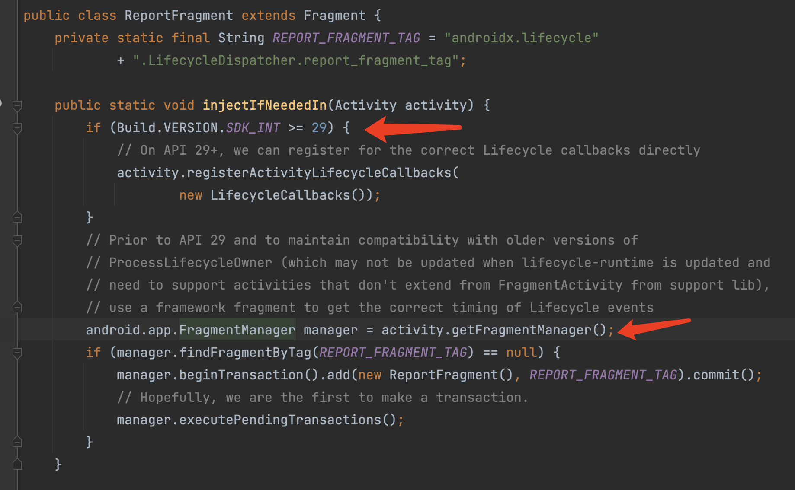
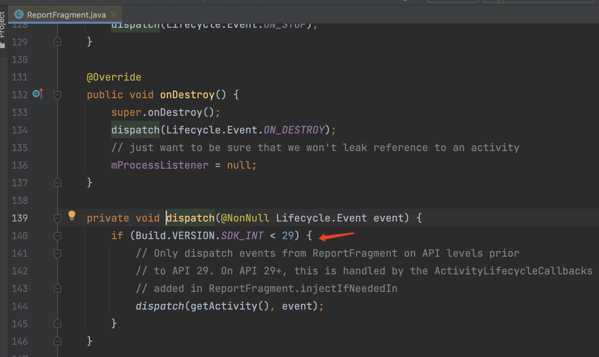
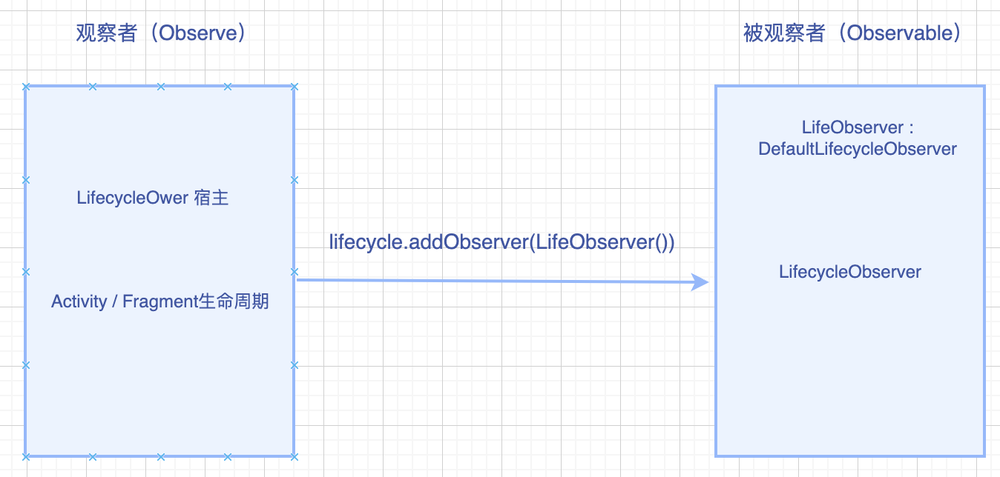

# Jetpack - Lifecycle 原理篇

本文涉及到的源码是：implementation("androidx.lifecycle:lifecycle-runtime-ktx:2.5.1")版本


1. 生命周期是如何触发的？
2. 页面状态是如何实现的？
3. 保存所有注册信息到map，分发的时候通过反射


## Lifecycle 的设计模式

Lifecycle 的设计思路主要使用了观察者设计模式。公众号就是典型的观察者设计模式，用户可以订阅自己喜欢的公众号，当公众号发表了文章，所有订阅的人都会收到通知。


Lifecycle 的设计模式：

- LifecycleOwner：被观察者实现此接口，通过  getLifecycle()  获取 Lifecycle，Lifecycle 通过 addObserver 添加观察者
- LifecycleObserver：观察者实现此接口，这是个空接口，用于标记这是观察者


被观察者可以有多个观察者


Lifecycle 源码：

```
public interface LifecycleOwner {
    @NonNull
    Lifecycle getLifecycle();
}


public interface LifecycleObserver {

}
```


实现`AppCompatActivity`类，默认就实现了 Lifecycle，因为`AppCompatActivity`的父类的父类`ComponentActivity`实现了被观察者`LifecycleOwner`接口.


## Lifecycle 的 States 和 Events

在 Lifecycle 类中，包含两个枚举类 State 和 Event，以事件驱动状态的变化。

```
    public enum State {
        DESTROYED,
        INITIALIZED,
        CREATED,
        STARTED,
        RESUMED;

        public boolean isAtLeast(@NonNull State state) {
            return compareTo(state) >= 0;
        }
    }
    
	public enum Event {
        ON_CREATE,
        ON_START,
        ON_RESUME,
        ON_PAUSE,
        ON_STOP,
        ON_DESTROY,
        ON_ANY;  
	}
```


State 和 Event 转换关系：

Lifecycle 是基于状态机的变化，触发生命周期，下图是构成 Android activity 生命周期的状态和事件


### 


通过状态来确定事件，分为前进和倒退。



为什么要这样设计？State用于干什么的？

Lifecycle 是面向所有框架的，Jetpack 里面所有库有关生命周期都是使用 Lifecycle，比如LiveData、ViewModel判断页面是否可见来处理，就是通过 Lifecycle 的 mState 通过 mActive 判断页面是否可见，其中，mState 记录所有状态。


页面是否可见活跃：DESTROYED、 INITIALIZED、CREATED 这三个状态返回false，STARTED，RESUMED 返回true。状态分为前进和倒退，对应的就是打开页面和退出页面。





状态对齐

1. 判断观察者和被观察者状态是否对齐

2. 对齐后，通过状态分发事件

   

**问题：为什么在onStop注册监听生命周期，会调用onCreate onDestory两个周期？**



因为 ON_STOP事件是倒退，会触发CREATED状态，而CREATED状态是 ON_DESTORY事件，所以会触发onDestory；

调用 onCreate 是因为在onStop里面注册时候，lifecyle会状态对齐，默认是状态是INITIALIZED，而INITIALIZED状态会触发ON_CREATE事件，所以会打印onCreate。




## Lifecycle 的实现原理

Lifecycle 的主要实现原理都是在 LifecycleRegistry 类中，Fragment 的生命周期则实现在 ReportFragment 里面。


Lifecycle 生命周期的源码实现和 Glide 图片加载库监听Activity/Fragment生命周期是一样的。都是通过添加空白的Fragment，监听Activity的生命周期，这样做的好处就是无感知的知道 Activity 的生命周期。


Glide 新版本也是 Lifecycle了




### ReportFragment



在 Android  API 大于等于 29 的时候，通过 registerActivityLifecycleCallbacks 监听生命周期。小于 29 的时候，通过Activity 绑定空白 ReportFragment 监听生命周期。


Android  API 大于等于 29 的时候为什么同时使用 registerActivityLifecycleCallbacks 和 ReportFragment ，并且为什么生命周期不会触发2次？

1. 不管什么版本 ReportFragment 里面还可以设置setProcessListener，为了给 Lifecycle 监听生命周期使用的。

2. ReportFragment 监听到生命周期的时候，分发的时候做了处理，SDK 小于 29 的时候，不处理。




## Lifecycle 的源码

```
lifecycle.addObserver(LifeObserver())


// 观察者
class LifeObserver : DefaultLifecycleObserver {
    override fun onCreate(owner: LifecycleOwner) {
          super.onCreate(owner)
    }
}
```



lifecycle 实现类是 LifecycleRegistry，lifecycle.addObserver 的时候：

1. ReflectiveGenericLifecycleObserver类ClassesInfoCache 通过反射获取 LifeObserver的 class 信息
2. 将观察者对象LifecycleObserver作为key，观察者LifecycleObserver的class信息，作为value，存储到HashMap，避免每次反射获取信息
3. 事件下发的时候，通过ReflectiveGenericLifecycleObserver分发


被观察者Activity默认继承AppCompatActivity`类，默认就实现了 Lifecycle，因为`AppCompatActivity`的父类的父类`ComponentActivity`实现了被观察者`LifecycleOwner`接口.


