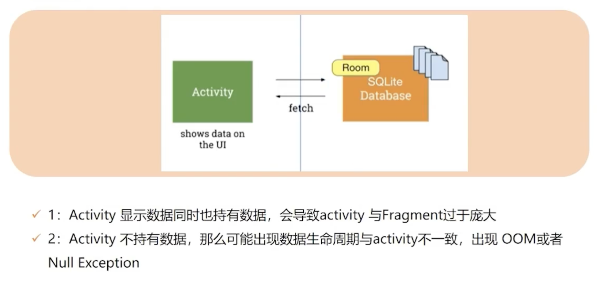
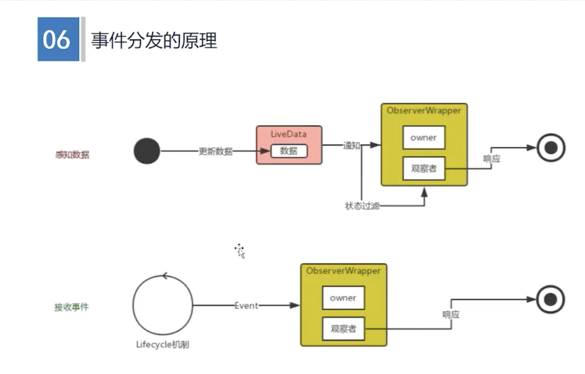

# Jetpack - LiveData

## LiveData 简介

1. LiveData 的背景

Android 应用开发中的一个常见问题，就是如何在组件之间有效地共享数据并确保 UI 及时更新？在传统的 Android 应用程序中，这通常需要使用回调或观察者模式来实现。但是这种方法常常容易出错，因为它们通常需要手动进行清理，并且容易导致内存泄漏。

背景：UI control 对数据访问



2. LiveData 的定义

   LiveData 是一个数据存储的容器，又可以感知组件的生命周期。当有数据更新的时候，其内部会判断数据观察者的生命周期状态，只有处于 active 状态的观察者，才会被通知，更新UI。

   [官方LiveData介绍](https://developer.android.com/topic/libraries/architecture/livedata?hl=zh-cn)

   

3. LiveData 的作用

   解耦 Activity 的业务，Activity 只做 UI 展示，LiveData 存储数据能力和管理数据能力。LiveData 数据变更，并不会马上触发，而是结合 Activity 的生命周期来更新 UI，让数据感应生命周期。

   

4. LiveData 的使用场景

   LiveData、ViewModel、Lifecyle 一般三者结合使用。当后台获取数据后，前台页面不可见的时候，LiveData 会将数据存储起来，当前台页面可见的时候，更新UI。

   

   场景：在 A 页面，跳转到 B 页面后，A 页面此时还有数据请求，数据请求完刷新 A 页面，那么当内存不足的 A 页面是有可能被回收的，这时候，数据请求完刷新 A 页面就会出空指针异常。

   

   


5. Flow 可以替代 LiveData，但是，LiveData 可以独立存在的，实现只有一个类实现的，数据结构比 Handler 更简单。

LiveData的优点：

- 轻量

- 简单

  

## LiveData 的使用（独立）

### 依赖

```
implementation("androidx.lifecycle:lifecycle-viewmodel:2.4.1")
```

### 使用

```
// 初始化
var liveData = MutableLiveData<String>()

// 监听数据，观察者通过 this 的生命周期来响应
liveData.observe(this, object : Observer<String> {
      override fun onChanged(t: String?) {
          Log.e("LiveDataActivity", "liveData : $t")
      }
})

// 主线程更新数据
liveData.setValue( "hello")

// 子线程更新数据
liveData.postValue("hello( child thread )")
```


- LiveData 如何存储数据的？

- LiveData 如何传递数据的？

- LiveData 如何在子线程传递的？


```
liveData.observe(this, object : Observer<String> {
      override fun onChanged(t: String?) {
          Log.e("LiveDataActivity", "liveData : $t")
      }
})
```


## LiveData 和 ViewModel 的使用（组合）


## LiveData 原理

`liveData.setValue` 先存储数据，当生命周期不符合的时候，不会传递出去。


LiveData 数据存储

- mData ： 主现程存储的数据
- mPendingData：子线程存储的数据


**为什么 LiveData的mData和mPendingData变量加volatile，而mVersion不需要加？**

- LiveData 的设计目的是支持数据在后台线程中的更新，并且能够保证观察者（Observer）在主线程中更新数据。mData 和 mPendingData 都是用于存储 LiveData 中的数据的变量，需要在多线程环境中保证可见性，所以需要用 volatile 关键字修饰。

- mVersion 的值只在 LiveData 内部使用，不需要在多个线程之间进行共享和同步，所以不存在线程不安全的情况。


