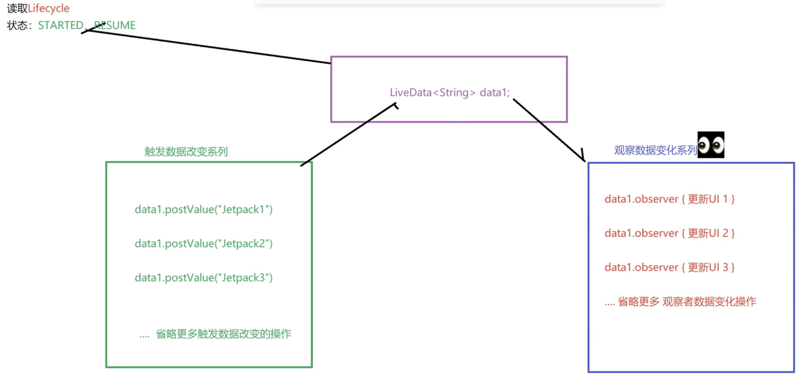
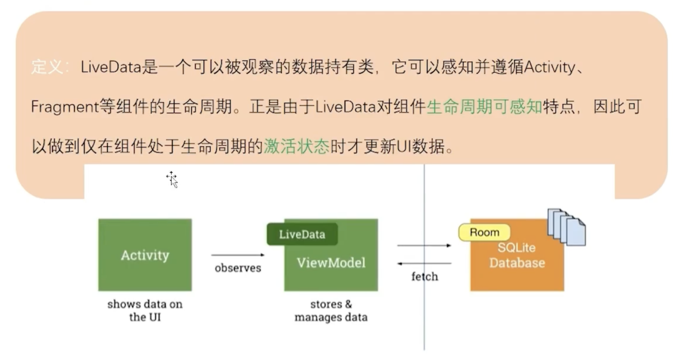

# Jetpack - LiveData

## LiveData 简介

1. LiveData 的背景

Android 应用开发中的一个常见问题，就是如何在组件之间有效地共享数据并确保 UI 及时更新？在传统的 Android 应用程序中，这通常需要使用回调或观察者模式来实现。但是这种方法常常容易出错，因为它们通常需要手动进行清理，并且容易导致内存泄漏。


LiveData 核心就是数据驱动 UI 更新，还可以感知页面的是否可见，这样做的好处就是页面处于不可见的时候，数据变更了，UI可以先不更新，节省资源，当页面恢复可见的时候，再更新 UI。


对比 Handler，Handler不管界面不可见都会触发，这样做的坏处就是有可能内存泄露




感知页面的是否可见的实现原理是通过读取 Lifecyle 的 状态实现的，只有当状态是 STARTED和 RESUME 才触发监听，更新 UI；

Handler 是不管页面的是否可见，都会触发


背景：UI control 对数据访问


2. LiveData 的定义

   LiveData 是一个数据存储的容器，又可以感知组件的生命周期。当有数据更新的时候，其内部会判断数据观察者的生命周期状态，只有处于 active 状态的观察者，才会被通知，更新UI。

   [官方LiveData介绍](https://developer.android.com/topic/libraries/architecture/livedata?hl=zh-cn)

   

3. LiveData 的作用

   解耦 Activity 的业务，Activity 只做 UI 展示，LiveData 存储数据能力和管理数据能力。LiveData 数据变更，并不会马上触发，而是结合 Activity 的生命周期来更新 UI，让数据感应生命周期。

   

4. LiveData 的使用场景

   LiveData、ViewModel、Lifecyle 一般三者结合使用。当后台获取数据后，前台页面不可见的时候，LiveData 会将数据存储起来，当前台页面可见的时候，更新UI。

   

   场景：在 A 页面，跳转到 B 页面后，A 页面此时还有数据请求，数据请求完刷新 A 页面，那么当内存不足的 A 页面是有可能被回收的，这时候，数据请求完刷新 A 页面就会出空指针异常。

   

   



5. Flow 可以替代 LiveData，但是，LiveData 可以独立存在的，实现只有一个类实现的，数据结构比 Handler 更简单。

LiveData的优点：

- 轻量

- 简单

  

## LiveData 的使用（独立）

### 依赖

```
implementation("androidx.lifecycle:lifecycle-viewmodel:2.4.1")
```

### 使用

```
// 初始化
var liveData = MutableLiveData<String>()

// 监听数据，观察者通过 this 的生命周期来响应
liveData.observe(this, object : Observer<String> {
      override fun onChanged(t: String?) {
          Log.e("LiveDataActivity", "liveData : $t")
      }
})

// 主线程更新数据
liveData.setValue( "hello")

// 子线程更新数据
liveData.postValue("hello( child thread )")
```


- LiveData 如何存储数据的？

- LiveData 如何传递数据的？

- LiveData 如何在子线程传递的？


```
liveData.observe(this, object : Observer<String> {
      override fun onChanged(t: String?) {
          Log.e("LiveDataActivity", "liveData : $t")
      }
})
```


### 单例模式实现

LiveData 可以替代 EventBus，数据更新和UI更新可以完全隔离，分工明确，对用户暴漏简单的接口，非常简单。

```
object SingleLiveData {  // 单例模式
    val info1 by lazy {  // 懒加载
        MutableLiveData<String>()
    }
}
```


Activity

```
        // 监听
        SingleLiveData.info1.observe(this, object : Observer<String> {
            override fun onChanged(t: String?) {
                // update ui
                Log.e("LiveDataActivity", "SingleLiveData : $t")
            }
        })


        // 数据更新
        SingleLiveData.info1.value = "default value" // 主线程
        thread {
            Thread.sleep(3000)
            SingleLiveData.info1.postValue("hello( child thread )") // 子线程
        }
```


DataBing可以解决手动监听更新UI


数据粘性，或者说是数据倒灌，是指我先发送数据变更，再监听数据变化还能接受到之前发送的数据；

常规逻辑是：先订阅，再触发数据变更，才能收到数据变化监听；而 LiveData 打破这个逻辑，先发后监听，也能收到之前发送的数据，注意这是只能接收到之前发送的最后1条数据


## LiveData 和 ViewModel 的使用（组合）


## LiveData 原理

`liveData.setValue` 先存储数据，当生命周期不符合的时候，不会传递出去。


LiveData 数据存储

- mData ： 主现程存储的数据
- mPendingData：子线程存储的数据


**为什么 LiveData的mData和mPendingData变量加volatile，而mVersion不需要加？**

- LiveData 的设计目的是支持数据在后台线程中的更新，并且能够保证观察者（Observer）在主线程中更新数据。mData 和 mPendingData 都是用于存储 LiveData 中的数据的变量，需要在多线程环境中保证可见性，所以需要用 volatile 关键字修饰。

- mVersion 的值只在 LiveData 内部使用，不需要在多个线程之间进行共享和同步，所以不存在线程不安全的情况。


### 中间件

MutableLiveData源码这一层使用了中间件，LiveData源码特别多，但是提供给用户的MutableLiveData API层，非常简单，装饰者模式（？？？）。

```
public class MutableLiveData<T> extends LiveData<T> {

    /**
     * Creates a MutableLiveData initialized with the given {@code value}.
     *
     * @param value initial value
     */
    public MutableLiveData(T value) {
        super(value);
    }

    /**
     * Creates a MutableLiveData with no value assigned to it.
     */
    public MutableLiveData() {
        super();
    }

    @Override
    public void postValue(T value) {
        super.postValue(value);
    }

    @Override
    public void setValue(T value) {
        super.setValue(value);
    }
}
```

