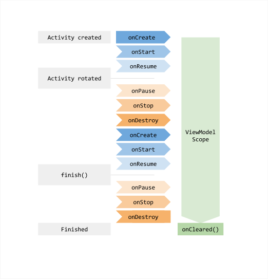

# Jetpack - ViewModel 使用篇

ViewModel 解决什么问题：

- 从网络获取数据，设置到textView，旋转屏幕，数据丢失（案例）
- EditText设置数据，旋转屏幕，数据丢失（案例）


ViewModel 可以保存临时数据，防止旋转屏幕丢失


## ViewModel 的使用场景

当我们开发应用的时候，修改应用配置的时候，Activity / Fragment 有可能重新创建，这时候会导致数据丢失，ViewModel 就是为了解决数据丢失问题，才出现的。比如：

- 旋转屏幕
- 切换成深色模式
- 修改语言
- 更改字体大小或主题颜色


ViewModel 是无法解决异常情况下的数据丢失的。


⚠️ 当应用在后台的时候，手机内存不足，页面被回收，ViewModel 是无法确保数据丢失的。（可以通过开发者模式，设置后台任务数为1来验证），这种情况，可以通过以下技术手段来解决数据丢失问题：

- 实现Activity的 onSaveInstanceState() 与 onRestoreInstanceState();
- 使用 SavedState，底层实现还是 onSaveInstanceState() ；
- 使用 SavedStateHandle ，本质上是依托于 SaveState 的实现;


- ViewModel
- AndroidViewModel


## ViewModel 的简单使用

### 依赖

```
implementation "androidx.lifecycle:lifecycle-viewmodel-ktx:2.5.1"
```

可选依赖

```
implementation 'androidx.activity:activity-ktx:1.5.1'
```


## ViewModel 的生命周期




参考资料：

> https://mp.weixin.qq.com/s/jAUVz8oDysnrCfopApqP1A


## Fragment 间共享数据

多个 Fragment 之前的数据共享，必须要在同一个 Activity 范围内共享一个 ViewModel 来共享数据。

```
class SharedViewModel : ViewModel() {
    val selected = MutableLiveData<Boolean>()
}

public class MasterFragment extends Fragment {
    private SharedViewModel model;
    
    public void onViewCreated(@NonNull View view, Bundle savedInstanceState) {
        super.onViewCreated(view, savedInstanceState);
        model = new ViewModelProvider(requireActivity()).get(SharedViewModel.class);
        
        itemSelector.setOnClickListener(item -> {
            model.selected.value = true
        });
	}
}

public class DetailFragment extends Fragment {
    public void onViewCreated(@NonNull View view, Bundle savedInstanceState) {
        super.onViewCreated(view, savedInstanceState);
        SharedViewModel model = new ViewModelProvider(requireActivity()).get(SharedViewModel.class);
        model.getSelected().observe(getViewLifecycleOwner(), { item ->
   					// Update the UI.
   					
				});     
	}
}
```


## Activity 和 Fragment 间通信

Activity 和 Fagment 之间传值一般使用构造和回调。除了这种方式外，还可以通过 ViewModel 实现。


```
class SharedViewModel : ViewModel() {
    val selected = MutableLiveData<Boolean>()
}
```


```
class MainActivity : AppCompatActivity() {

    override fun onCreate(savedInstanceState: Bundle?) {
        super.onCreate(savedInstanceState)
        setContentView(R.layout.main_activity)
        
        var shareModel = ViewModelProviders.of(this).get(SharedViewModel::class.java)
        
        if (savedInstanceState == null) {
            supportFragmentManager.beginTransaction()
                .replace(R.id.container, MainFragment.newInstance())
                .commitNow()
        }
        
        shareModel.selected.value = true
    }
}
```


```
class MainFragment : Fragment() {

    companion object {
        fun newInstance() = MainFragment()
    }

    private lateinit var viewModel: MainViewModel
    private val model: SharedViewModel by activityViewModels1()
    
    override fun onCreateView(inflater: LayoutInflater, container: ViewGroup?,
                              savedInstanceState: Bundle?): View {
        return inflater.inflate(R.layout.main_fragment, container, false)
    }

    override fun onActivityCreated(savedInstanceState: Bundle?) {
        super.onActivityCreated(savedInstanceState)
        
        viewModel = ViewModelProviders.of(this).get(MainViewModel::class.java)
        model.selected.observe(viewLifecycleOwner, Observer {
            Toast.makeText(activity,it.toString(),Toast.LENGTH_SHORT).show()
        })
    }

}
```


## SavedStateHandle

ViewModel 的异常情况的模拟

- 运行app到模拟器
- 把 app 放到后台
- 点击 [关闭后台活动] 

