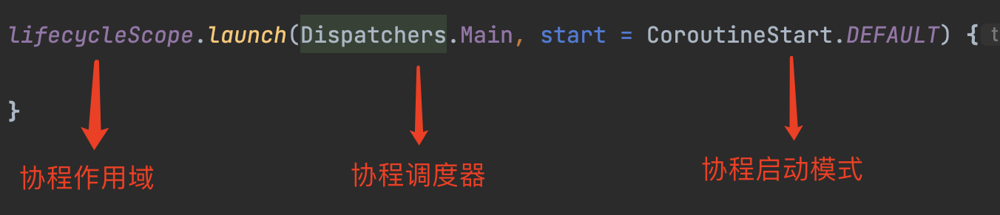

# Kotlin 协程（coroutines）

想要了解协程，必须先掌握进程和线程，进程、线程、协程三者环环相扣。

协程就是**用同步代码写出异步的效果**，协程必须依赖线程，简化代码，程可以解决异步任务嵌套依赖问题。


## 1. 协程的基本概念

协程主要两个关键点就是：

- 挂起（suspend）

- 恢复（resume）

  

协程和线程的区别：

- 线程一旦启动了，不会自动暂停，一直到执行结束，而且线程之间会抢夺CPU调度
- 协程是协作，在线程中，可以自由切换
- 线程的调度是操作系统实现的，这些对程序员都不可见，而协程是在用户态实现的，对程序员可见，协程的调用由程序员决定。


协程结构：

协程任务调度器



## 2. 协程使用

### 2.1 添加依赖库

协程一般和lifecycle、viewmodel结合使用，所以添加依赖的时候，也需要 lifecycle 和 viewmodel

> 协程依赖库：https://github.com/hltj/kotlinx.coroutines-cn/blob/master/README.md#using-in-your-projects 

```
// 协程依赖库
implementation "org.jetbrains.kotlinx:kotlinx-coroutines-core:1.7.0"
implementation "org.jetbrains.kotlinx:kotlinx-coroutines-android:1.7.0"

// lifecycle 和 viewmodel 依赖库
implementation "androidx.lifecycle:lifecycle-runtime-ktx:2.6.1"
implementation "androidx.lifecycle:lifecycle-viewmodel-ktx:2.6.1"
```


### 2.2 启动协程

开启协程是通过 launch 返回的是 Job 对象，涉及到协程作用域（CoroutineScope），不同地方，使用不同的协程作用域。


**协程作用域**

- GlobalScope：顶级协程，生命周期和App一样长，当前页面销毁了，协程仍然还在，谨慎使用，启动一个新的线程，在新线程上创建运行协程，不堵塞当前线程
- MainScope：实现是一个函数，可以取消的协程
- lifecycleScope：只能在 Activity / Fragment 中使用，绑定了 Activity / Fragment 的生命周期
- viewModelScope：只能在 ViewModel 中使用，绑定了 ViewModel 的生命周期
- runBlocking：是一个阻塞的函数，创建新的协程，运行在当前线程上，所以会堵塞当前线程，直到协程体结束


#### GlobalScope

全局协程，生命周期和应用一样长，可以在任意地方使用，但是使用 GlobalScope 的时候，会有一个提示：

>This is a delicate API and its use requires care. Make sure you fully read and understand documentat

这个提示是谨慎使用，不是弃用，全局协程，生命周期和应用一样长，使用不好，会导致内存泄漏

```
GlobalScope.launch(Dispatchers.Main) { // 主线程执行

}
```


#### MainScope

实现方式一：

```
val mainScope = MainScope()
mainScope.launch { 
            
}

// 取消，会抛出取消的异常
mainScope.cancel()
```

实现方式二：

```
class KtMainActivity2 : AppCompatActivity(), CoroutineScope by MainScope() {
    override fun onCreate(savedInstanceState: Bundle?) {
        super.onCreate(savedInstanceState)
        
        launch {
            // TODO 
        }
    }

    override fun onDestroy() {
        super.onDestroy()
        cancel()
    }
}
```


#### lifecycleScope

在 Activity / Fragment 中，推荐使用 lifecycleScope

```
lifecycleScope.launch(Dispatchers.Main) { // Activity / Fragment 中，推荐这种写法

}
```


#### viewModelScope

在 ViewModel 中，推荐使用 viewModelScope

```
viewModelScope.launch(Dispatchers.Main) {

}
```


#### runBlocking

runBlocking 会阻塞当前线程，直到运行结束

```
runBlocking {
             
}
```


### 2.3 取消协程

```
val job = lifecycleScope.launch{

}

job.cancel() // 取消协程
```


### 2.4 线程切换

```
lifecycleScope.launch(Dispatchers.Main) { // main
	 withContext(Dispatchers.IO) {          // io

	 }
}
```


### 2.5 并行执行

同时执行多个任务，统一处理多个结果，通过 async 和 await 组合实现。

```
    fun mulTask() {
        lifecycleScope.launch {// 同时执行多个任务
            val user1 = async(Dispatchers.IO) {
                fetchUserInfo("Jack")
            }

            val user2 = async(Dispatchers.IO) {
                fetchUserInfo("Tom")
            }

            val userInfo1 = user1.await()
            val userInfo2 = user2.await()

            Log.i(TAG, "userInfo1=$userInfo1")
            Log.i(TAG, "userInfo2=$userInfo2")
        }
    }

    suspend fun fetchUserInfo(uerUuid: String): String {
        withContext(Dispatchers.IO) {
            delay(2000L) // 模拟 网络请求
        }
        return "{\"userUuid\":$uerUuid,\"userName\":\"zhangsan\"}"
    }
```


### 2.6 捕获异常

**局部异常捕获**

```
// 写法一：不推荐这种
lifecycleScope.launch(Dispatchers.Main) {
	try {
			// 业务代码

	} catch (e: Exception) { // 协程抛出的异常无法捕获

	}
}

// 写法二：推荐这种
val executionHandler = CoroutineExceptionHandler { _, throwable ->
	val message = throwable.message // error message
	}

	lifecycleScope.launch(Dispatchers.IO + executionHandler) {
            // 业务代码
	}
}
```

**全局异常捕获**


## 3. 协程 launch 参数

### 3.1 launch 参数

```
public fun CoroutineScope.launch(
    context: CoroutineContext = EmptyCoroutineContext,
    start: CoroutineStart = CoroutineStart.DEFAULT,
    block: suspend CoroutineScope.() -> Unit
)
```

- context：协程调度器

- start：协程启动模式

- block：协程体

  

### 3.2 协程调度器 （Dispatchers）

- Dispatchers.Main： Android 主线程

  - 处理UI交互和轻量级任务

  - 调用suspend函数

  - 更新LiveData数据

- Dispatchers.IO： 非主线程，专门为执行磁盘或网络 I/O进行了优化

  - 数据库操作

  - 网络请求

  - 文件读写

- Dispatchers.Default：默认参数，非主线程，专门为CPU密集型任务做了优化，使用到线程池，适合在主线程之外执行占用大量 CPU 资源的工作

  - 数据解析

  - 数组排序

  - 处理差异化判断

- Dispatchers.Unconfined：直接执行，很少使用

  
  
  注意：Dispatchers.Default 和 Dispatchers.IO 的取消协程方式一样
  
  

### 3.3 协程启动模式（CoroutineStart）

- CoroutineStart.DEFAULT：立刻执行
- CoroutineStart.LAZY：在需要的时候，执行
- CoroutineStart.ATOMIC：立刻执行，在开始执行前，无法取消
- CoroutineStart.UNDISPATCHED：立刻执行，一直运行到第一个suspend


### 3.4 协程作用域（CoroutineScope）

CoroutineScope 协程作用域可以启动，追踪协程，还可以取消协程