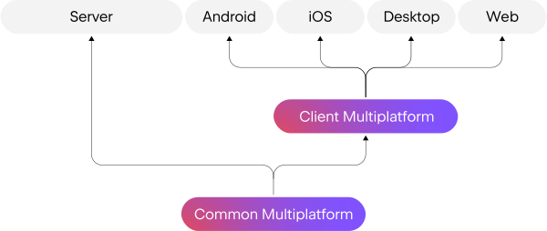
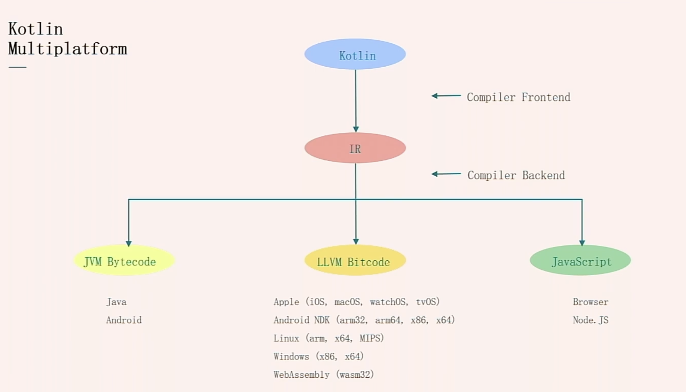
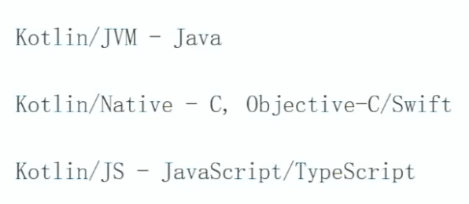
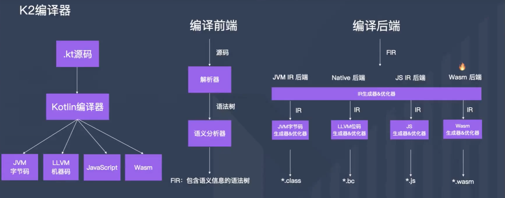
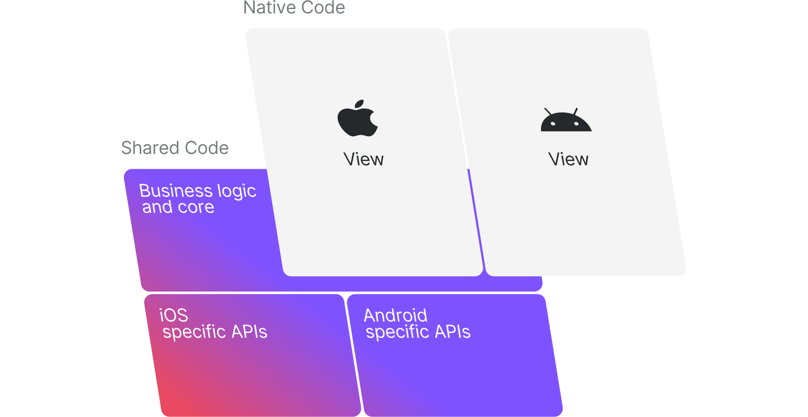
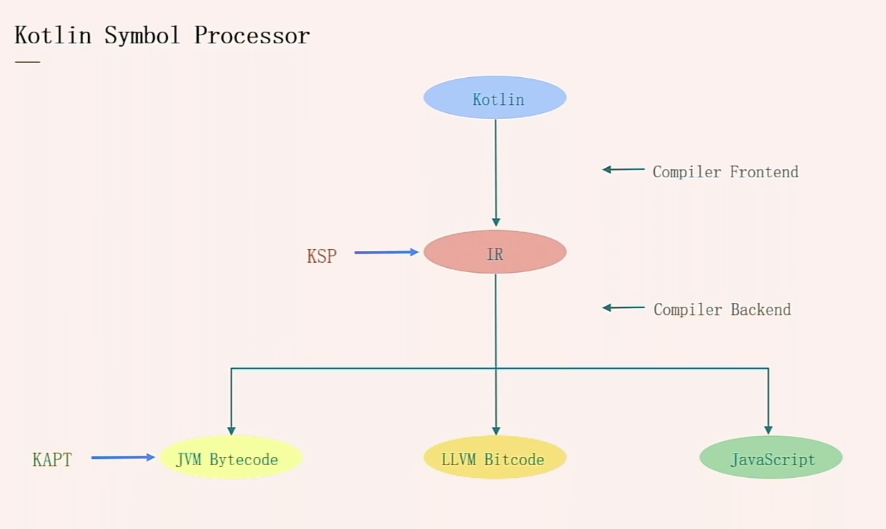
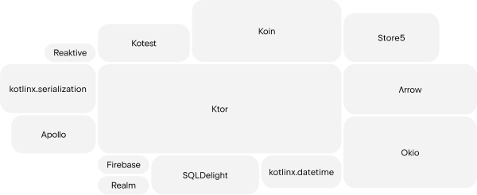
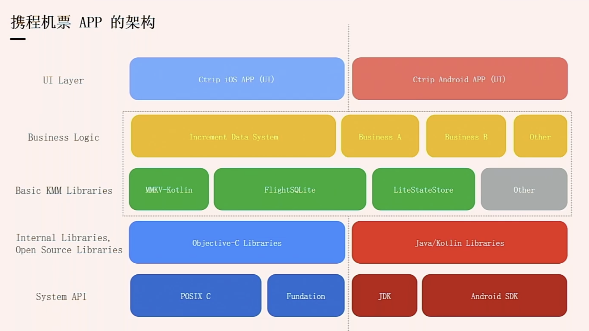

# Kotlin Multiplatform

## Kotlin 跨平台

Kotlin Multiplatform 处于测试阶段

## Kotlin 跨平台的实现原理

Kotlin 支持的跨平台，是基于编译器实现跨平台。

编译器分为

- 前端编译器：将 Kotlin 代码编译成中间产物 IR

- 后端编译器：不同平台的编译器，将 IR 编译成平台产物，

  - Java 平台：生成字节码

  - 先编译成 LLVM 二进制码，再编译成原生系统的二进制可执行文件

    

这样做的好处：让 Kotlin 具备调用原生系统的能力（API）

最新原理

## Kotlin Multiplatform Moblie（KMM）

对于移动端开发来说，对于 UI （View）需要各种实现，目前来说还没有成熟跨平台的库。

图片来源 Kotlin 官网：https://www.kotlincn.net/

开发工具

- Android Studio + KMM 插件 + Xcode
- IntelliJ IDEA + Xcode
- AppCode + Xcode

AppCode 可以直接写Swift，不用使用 Xcode

## Kotlin Symbol Processor（符号处理器）

Google 发布的工具 KSP，KAPT 是基于 APT，只能处理 Java 字节码，不能实现跨平台。通过 KSP 处理注解处理和代码生成，基于 IR 分析，KSP 比 KAPT 更快。

## Kotlin 跨平台的开源框架

- System API：基础库
- Internal Libraries / Open Source Libraries：内部库，用平台原生语言写的
- Basic KMM Libraries：LiteStateStore自实现的LiveModel
- Business Logic：数据业务逻辑
- UI Layer：UI 无法实现跨平台，各端实现