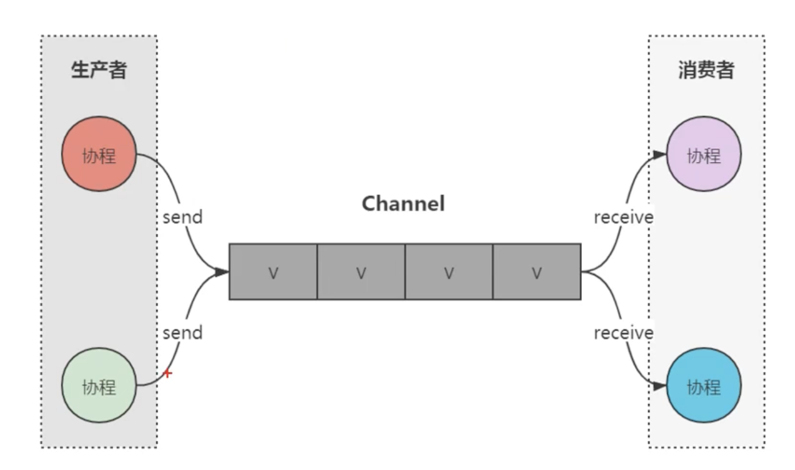

# Kotlin 协程 Channel

## Channel

Channel 是一个**并发安全的队列**，用于连接协程，实现协程间的通信。



既然 Channel 是一个并发安全的队列，那么一定就有缓冲区。如果缓冲区满了并且没有receive接收数据，那么send函数就会挂起，直到有接收端receive接收数据。


Channel 默认缓冲区大小是 0 ，也就意味着生产者发送一个，消费者消费一个，如果发送没有消费，就会挂起。

```
public const val RENDEZVOUS: Int = 0 // 默认缓冲区大小是 0

public fun <E> Channel(
    capacity: Int = RENDEZVOUS, 
    onBufferOverflow: BufferOverflow = BufferOverflow.SUSPEND,
    onUndeliveredElement: ((E) -> Unit)? = null
)
```


生产者比消费者慢一秒，就会挂起，等待消费者消费完，再发送下一个

```
    /**
     * send发送一次，等待receive消费，才会继续发送
     */
    fun start2() {
        val channel = Channel<Int>()
        runBlocking {
            // 生产者
            val product = GlobalScope.launch {
                var i = 0
                while (true) {
                    delay(1000)
                    channel.send(++i)
                    Log.e(TAG, "send : $i")
                }
            }

            // 消费者
            val consumer = GlobalScope.launch {
                while (true) {
                    delay(2000)
                    val data = channel.receive()
                    Log.e(TAG, "receive : $data")
                }
            }

            joinAll(product, consumer)
        }
    }
```


Channel 是队列，那么就像集合一样，通过 iterator 一样遍历数据。

```
    fun start3() {
        // Channel.UNLIMITED : 值为Int.MAX_VALUE，可以理解为无限大
        val channel = Channel<Int>(Channel.UNLIMITED)
        runBlocking {
            // 生产者
            val product = GlobalScope.launch {
                for (i in 0..5) {
                    channel.send(i)
                    Log.e(TAG, "send : $i")
                }
            }

            // 消费者
            val consumer = GlobalScope.launch {
                val iterator = channel.iterator()
                while (iterator.hasNext()) {
                    val data = iterator.next()
                    Log.e(TAG, "receive : $data")
                    delay(2000) // 每隔着2s，获取1次
                }
            }

            joinAll(product, consumer)
        }
    }
```

