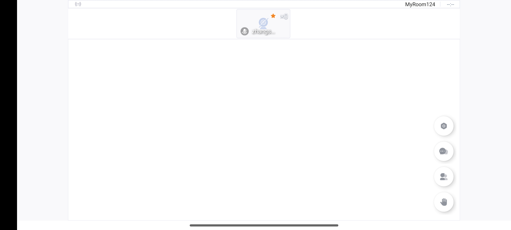
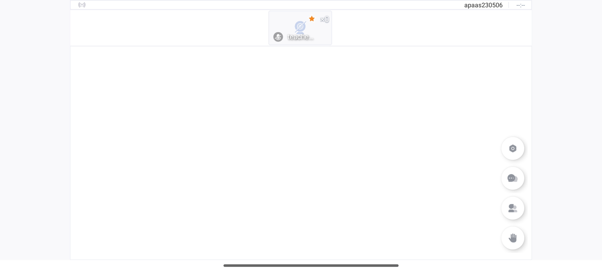

# Android 兼容刘海屏

## 效果

兼容前




兼容后



## 兼容

在 Activity 的 onCreate 方法，新增以下方法

```
    fun setLayoutInDisplayCutoutMode() {
        if (Build.VERSION.SDK_INT >= Build.VERSION_CODES.P) {
            val lp = window.attributes
            lp.layoutInDisplayCutoutMode = LAYOUT_IN_DISPLAY_CUTOUT_MODE_SHORT_EDGES
            window.attributes = lp
//            window.decorView.systemUiVisibility = View.SYSTEM_UI_FLAG_FULLSCREEN or View.SYSTEM_UI_FLAG_LAYOUT_STABLE
//            window.statusBarColor = Color.parseColor("#00000000")
        }
    }
```

