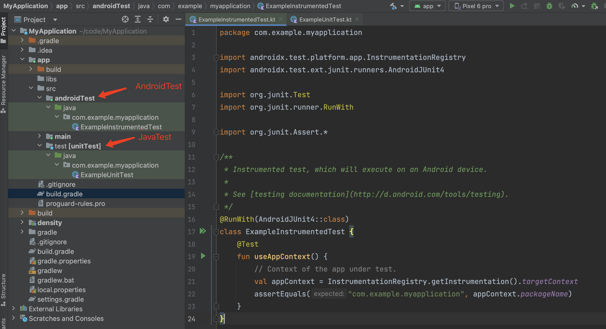

# Android 单元测试

Android Studio 创建 Project 或者 module 的时候，会自动创建单元测试的依赖和文件目录。 Android 单元测试主要分为：AndroidTest 和 JavaTest，AndroidTest 需要 Android 真机运行，运行速度慢，而JavaTest只需要有 Java 环境就可以运行，执行速度快。


## Mockito

Mockito框架就是为可以在单元测试的时候可以创建一个类的虚假的对象，Mockito官方网址： https://javadoc.io/static/org.mockito/mockito-core/3.5.10/org/mockito/Mockito.html


1. 添加依赖

   ```
   testImplementation "org.mockito:mockito-core:2.6.1"
   androidTestImplementation "org.mockito:mockito-android:2.6.1"
   ```

2. 使用


## junit

Android 单元测试目录结构



其中：

- androidTest ：单元测试，需要有Android环境，所以运行需要在真机上运行
- test：单元测试，又叫 uintTest 可以直接运行，只需要有 Java 的环境就可以

创建 Android 项目的时候自动添加的依赖库

```
 testImplementation 'junit:junit:4.+'
 androidTestImplementation 'androidx.test.ext:junit:1.1.2'
 androidTestImplementation 'androidx.test.espresso:espresso-core:3.3.0'
```


