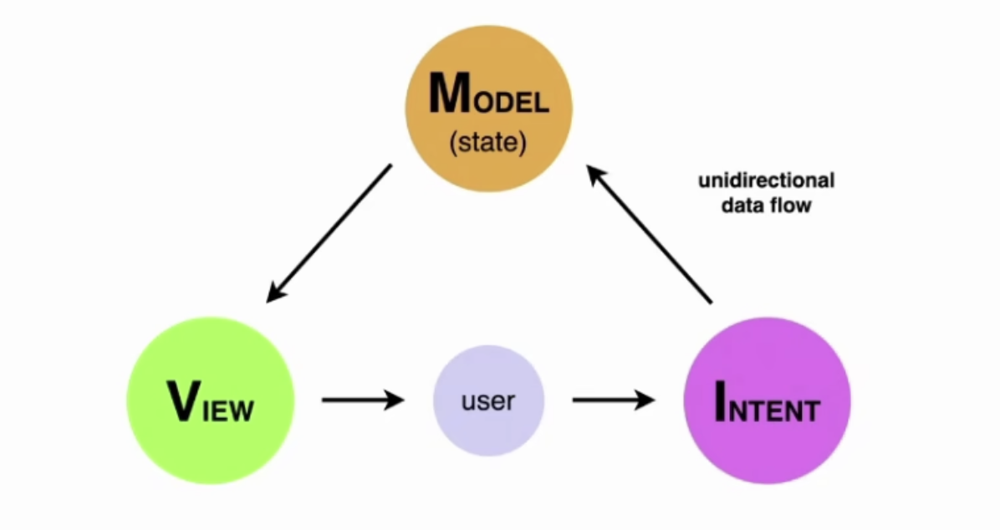
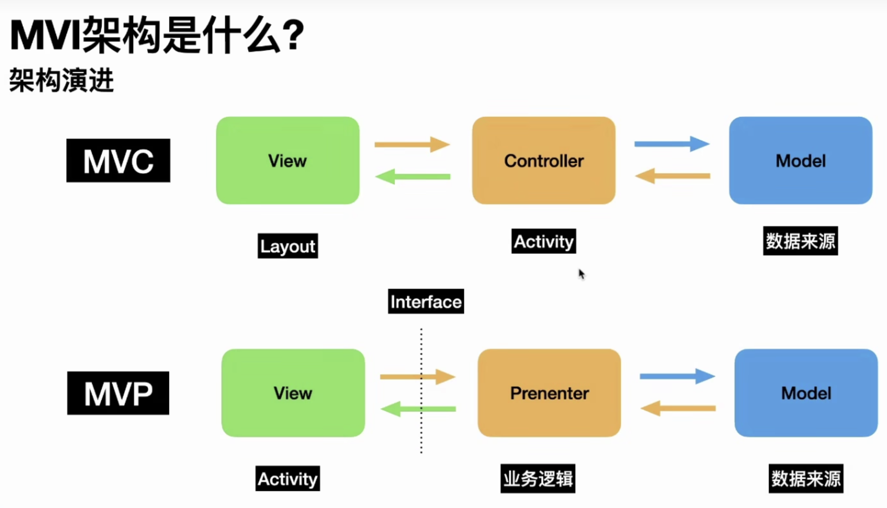

# MVI

**MVI 架构**

MVI 架构（Model-View-Intent）是单向数据流，其中：

- M ： Model，是指页面的状态，而MVC、MVP中的Model是指从网络或者本地获取的数据，作用是不一样的
- V：View，表示页面的UI，和MVC、MVP中的V是一样的作用
- I：Intent，表示用户的意图

当用户操作页面的时候，通过Intent发送意图来通知 Model层，Model 收到 Intent 会更新页面的状态，而 View 层会监听 Model的状态来更新 UI。

**Android 架构演进的流程**

