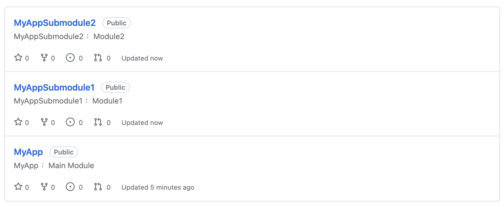
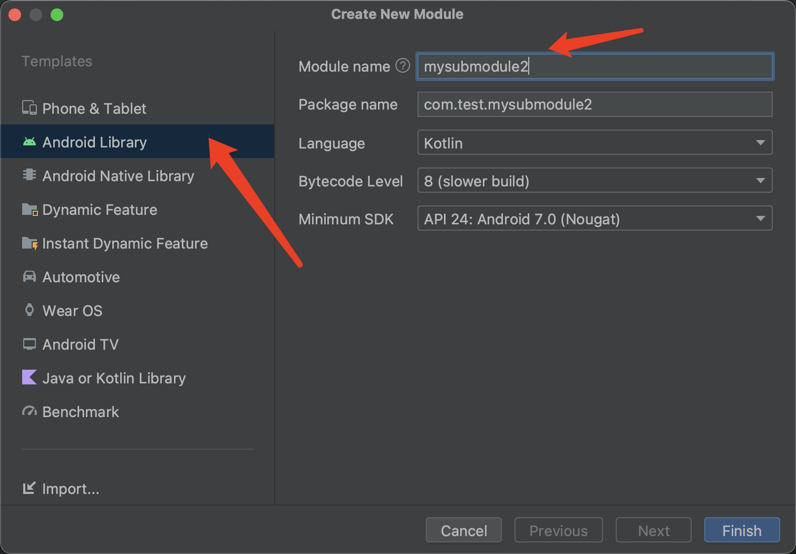
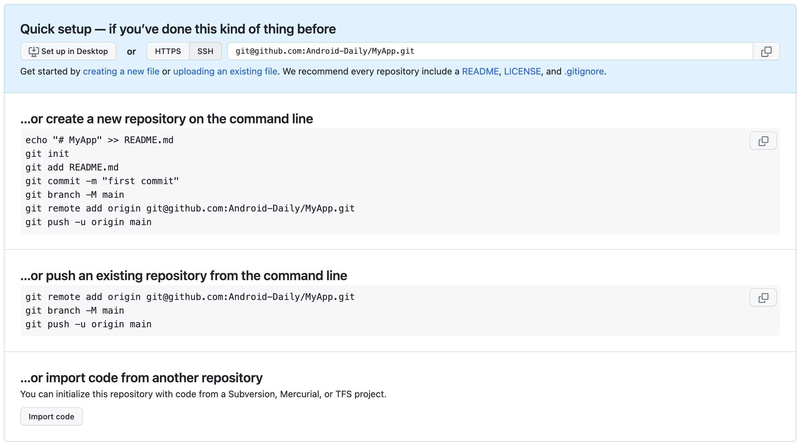
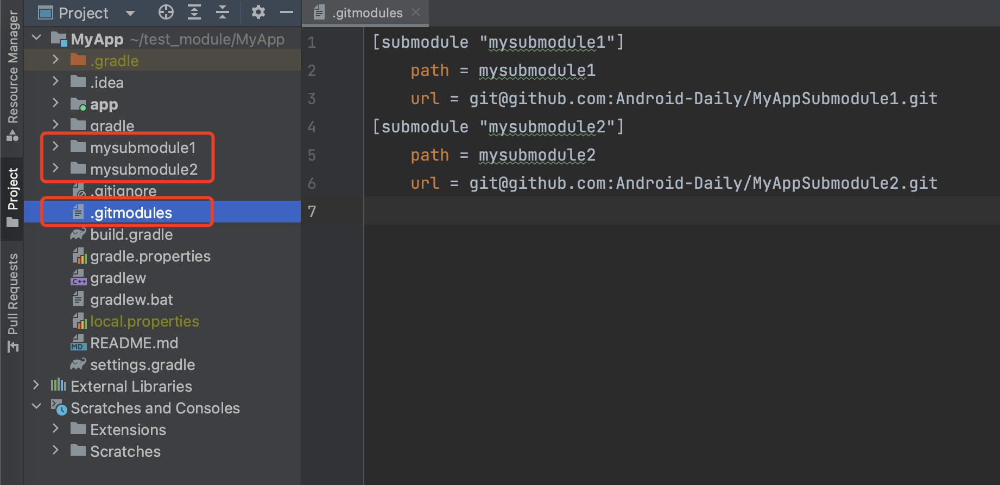
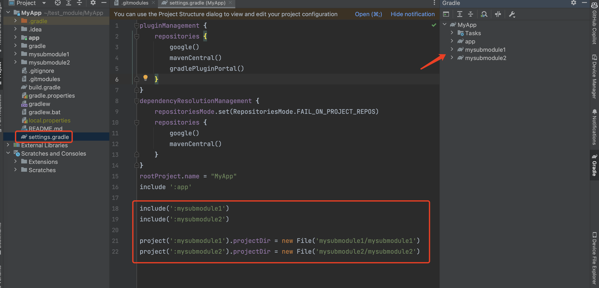
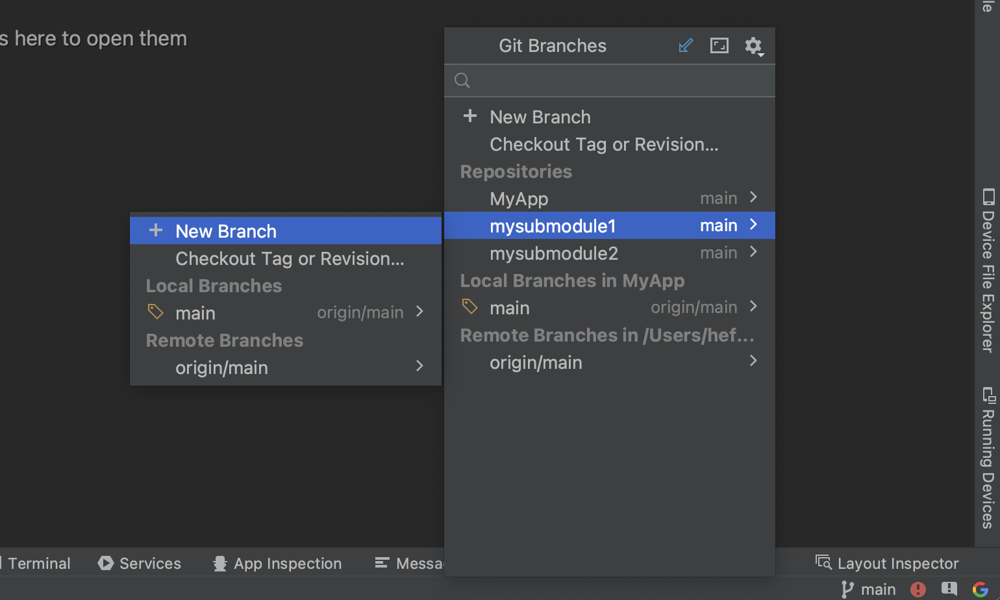

#  Git Submodule（Android）

## 1. Git Submodule 简介

在 Git 中，通过 Git Submodule，允许你将一个 Git 仓库嵌套在另一个仓库中，也就是说不同仓库的代码可以互相引用。这样做的好处就是不同的模块代码可以放在不同的代码仓库。


## 2. Git Submodule 的使用

本文代码托管在 Github 来演示`Git Submodule`的使用。其中，MyApp 为主项目，依赖 MyAppSubmodule1 和 MyAppSubmodule1 模块。

- MyApp

  - MyAppSubmodule1

  - MyAppSubmodule2

    

- 本文演示代码：https://github.com/Android-Daily/MyApp

### 2.1 创建项目

#### 2.1.1 创建远程仓库

在 GitHub 上创建 3 个项目模块，分别是：

- MyApp
- MyAppSubmodule1
- MyAppSubmodule2




#### 2.1.2 创建本地项目

通过 Android Studio 创建 3 个项目，分别是GitHub创建的名称对应（MyApp、MyAppSubmodule1、MyAppSubmodule2），注意在 MyAppSubmodule1 和 MyAppSubmodule2 项目下面再创建 Android Library。




为了方便测试，在 MyAppSubmodule1 和 MyAppSubmodule2 的 module 里面新增 2 个类 SubModule1和SubModule2，内容一样，只是类名不一样：

```
class SubModule2 {
    var name = "SubModule2"

    fun setSubModuleName(name: String) {
        this.name = name
    }

    fun getSubModuleName(): String {
        return name
    }
}
```


#### 2.1.3 关联仓库代码

将本地代码 和 Github 远程仓库关联，这里以 MyApp 为例子，MyAppSubmodule1 和 MyAppSubmodule2 关联方式一样。

在 MyApp 项目目录下，打开命令行，分别执行以下命令：

```
git init
git commit -m "init project"
git branch -M main
git remote add origin git@github.com:Android-Daily/MyApp.git
git push -u origin main
```

Github 的 MyApp里面，也有 Git 命令操作提示：




至此，3个项目远程仓库地址地址有了，先记录下来，后面需要使用

- MyApp：`git@github.com:Android-Daily/MyApp.git`

- MyAppSubmodule1：`git@github.com:Android-Daily/MyAppSubmodule1.git`
- MyAppSubmodule2：`git@github.com:Android-Daily/MyAppSubmodule2.git`


### 2.2 关联子模块(Submodule)

#### 2.2.1 添加子模块(Submodule)

主项目 MyApp 需要依赖 MyAppSubmodule1 和 MyAppSubmodule2 的模块代码。在 MyApp 目录下，打开命令行，执行命令，执行：

```
 git submodule add git@github.com:Android-Daily/MyAppSubmodule1.git mysubmodule1
```

 ```
  git submodule add git@github.com:Android-Daily/MyAppSubmodule2.git mysubmodule2
 ```


其中

- 倒数第一个参数是指子模块存放的目录
- 倒数第二参数是指子模块 git 地址


执行完命令，会自动拉取  MyAppSubmodule1 和 MyAppSubmodule2 的代码，但是这个时候主项目 MyApp和MyAppSubmodule1、MyAppSubmodule1并没有建立引用。




#### 2.2.1 代码引用

1、配置 MyAppSubmodule1 和 MyAppSubmodule2 为当前项目的模块，配置完成后，就可以在 Gradle 中看到项目名称，在 settings.gradle 文件下，配置如下代码：

```
include(':mysubmodule1')
include(':mysubmodule2')

project(':mysubmodule1').projectDir = new File('mysubmodule1/mysubmodule1')
project(':mysubmodule2').projectDir = new File('mysubmodule2/mysubmodule2')
```



2、在 MyApp 的 build.gradle 文件里面，引用 mysubmodule1 和 mysubmodule2，就可以正常使用子模块的代码了

```
implementation project(path: ':mysubmodule1')
implementation project(path: ':mysubmodule2')
```


#### 2.2.2 管理分支

Android Studio 右下角直接操作分支




## 3. Git Submodule 命令

 #### 3.1 添加子模块

```
 git submodule add <repository_url> <path>
```

其中，`<repository_url>` 是子模块仓库的 URL，`<path>` 是将子模块放置在父仓库中的相对路径。


#### 3.2 拉取所有子模块

```
git submodule foreach git pull
```


```
git submodule update --remote
```


#### 3.3 删除子模块

```
git rm -r --cached <submodule name>
```


#### 3.4 初始化和更新子模块

在克隆父仓库后，子模块并不会自动初始化或更新。你需要运行以下命令来初始化和更新子模块：

```
git submodule init
git submodule update
```

或者

```
git submodule update --init
```


#### 3.5 克隆含有子模块的项目

```
git clone <repository_url>
cd <repository_directory>
git submodule update --init --recursive --remote
```

注意：克隆代码后，检查代码分支