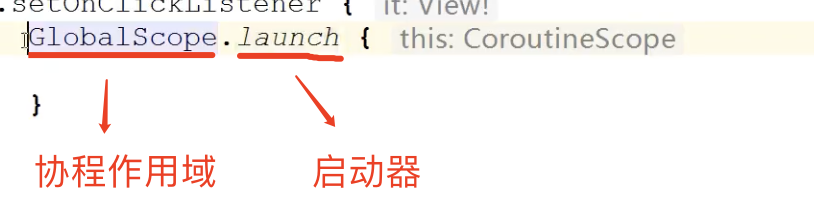

# 协程

在 Android 开发中，Java 语言并没有协程这个实现和概念，而 Kotlin 实现了协程，并提供 API 供开发者使用。


## 1. 协程的定义

协程的定义：协程基于线程，它是**轻量级的线程**，依赖于 Kotlin 语法。用同步的写法实现异步任务，可以解决回调地狱

协程：coroutine，是两个单词的组合而成，其中 co 是指 cooperation，后半部是指 routine


协程可以来干什么：

- 处理耗时任务
- 切换线程
- 确保主线程安全（通过主线程调用任何挂起函数 suspend）


GloalScope：顶级协程，协程作用域




## 2. 协程基本概念

案例：网络请求做对比


协程的函数：

- suspend：暂停/挂起，暂停当前的协程，并保存局所有部变量
- resume：恢复暂停的协程，一般很少直接用resume，因为用的都是协程封装好的函数


挂起和阻塞的区别：挂起就是先登记，你可以继续做其他事情，而阻塞什么事情做不了，只能等上一个事情做完，才能继续做。


**挂起**

```
findViewById<Button>(R.id.btn_coroutine2).setOnClickListener {
     // 主线程：挂起，不会阻塞点击
     lifecycleScope.launch(Dispatchers.Main) {
          delay(10_000)
          Log.d("test","delay 10s")
    }
}
```


**阻塞**

```
findViewById<Button>(R.id.btn_coroutine2).setOnClickListener {
	// 主线程：阻塞，点击后，就会卡住
	Thread.sleep(10_000)
	Log.d("test", "delay 10s")
}
```


协程层级

- 基础设施层 

  ```
  val coronitue = suspend {
              5
  }.createCoroutine(object : Continuation<Int> {
  		override val context: CoroutineContext
  				get() = EmptyCoroutineContext
  
  		override fun resumeWith(result: Result<Int>) {
  				Log.d("test", "coroutine result = ${result.getOrNull()}")
      }
  })
  
  // 启动协程
  coronitue.resume(Unit)
  ```

  

- 业务框架层：lifecycleScope

  ```
  lifecycleScope.launch(Dispatchers.Main) {
       5       
  }
  ```

  

## 3. 协程调度器

所有协程必须在协程调度器中使用，如果没有设置，则默认在 Dispatchers.Default 中执行。

