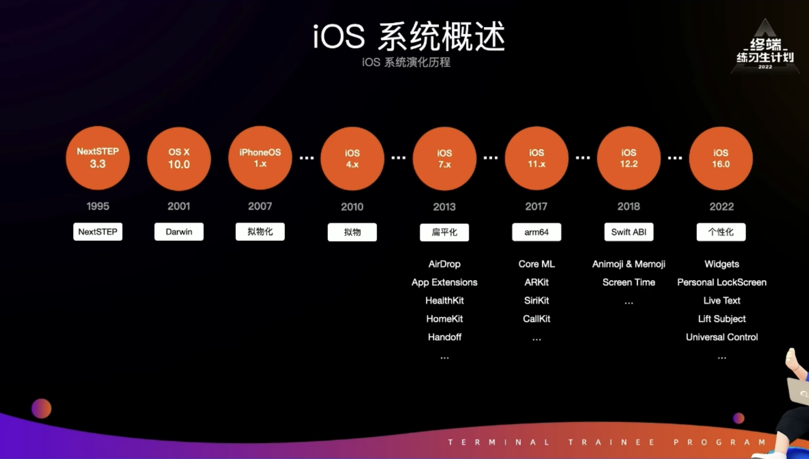
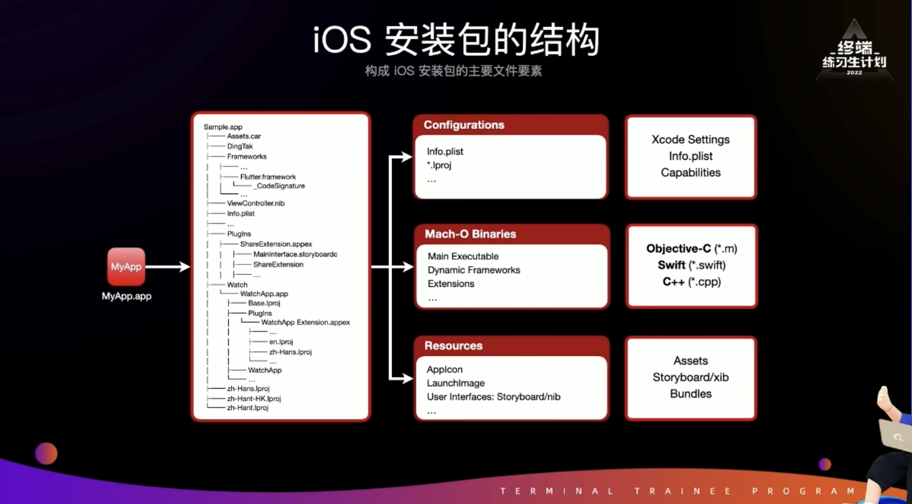
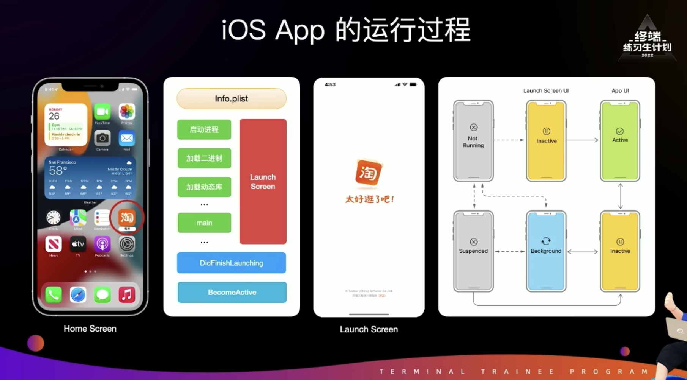

# iOS 开发

## iOS 开发环境

- Mac 电脑
- Xcode：官方唯一的开发工具，https://developer.apple.com/xcode/
- SwiftUI：https://developer.apple.com/cn/xcode/swiftui/

## iOS 系统

iOS 系统是由桌面操作系统 MacOS X 系统移植而来的，它的内核是Darwin，而 Darwin 是 NextSTEP和 BSD 融合演化出来的；所以在后续开发中，可以看到很多 NS 开头的类。

## iOS 安装包结构

iOS 中的 app 安装包是以 **.app** 结尾的文件包，安装包主要分为3大类：

- 配置类文件：比如 plist 配置App的基本信息，多语言
- 二进制文件：安装包的二进制文件主要是以 Mach-O 的方式存储（同Windows的exe文件一样），可以通过MachOView工具打开
- 资源文件：比如图片资源

## iOS App 启动过程

冷启动：当用户点击 App 图标的时候，系统会读取 Info.plist 文件，加载 App的代码和资源文件，给 App分配 进程和内存等，一般这个过程比较长，所以才有 Launch Screen 来过渡。

热启动：通过手势或者Home键，将App放到后台后，只能处理一些简单的任务，从后台模式切换到前台活跃状态的过程叫热启动。

启动 App 完成后，从非活跃状态转变成活跃状态	

