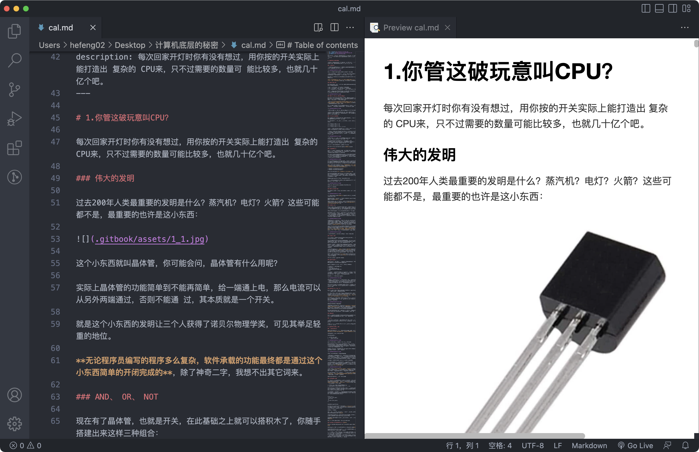
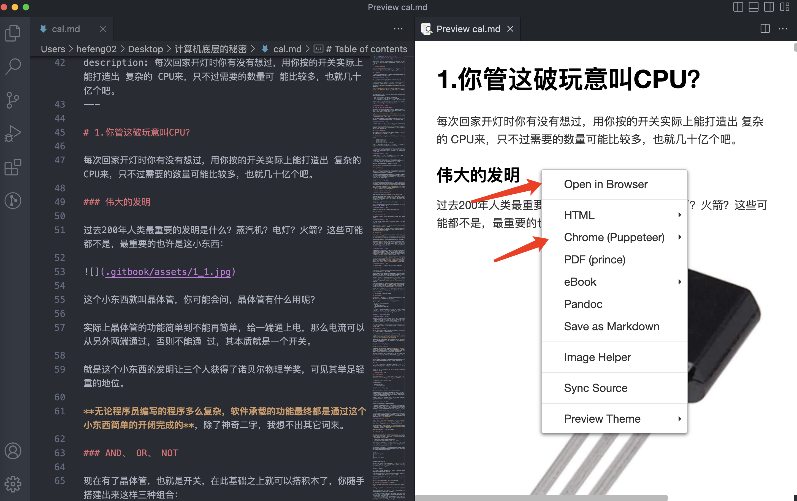
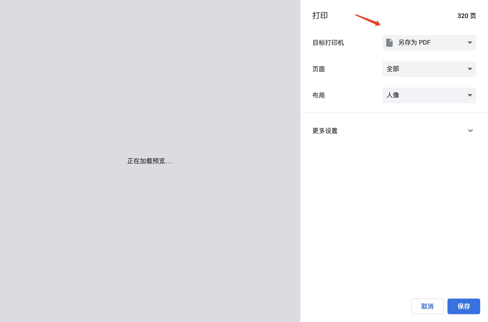
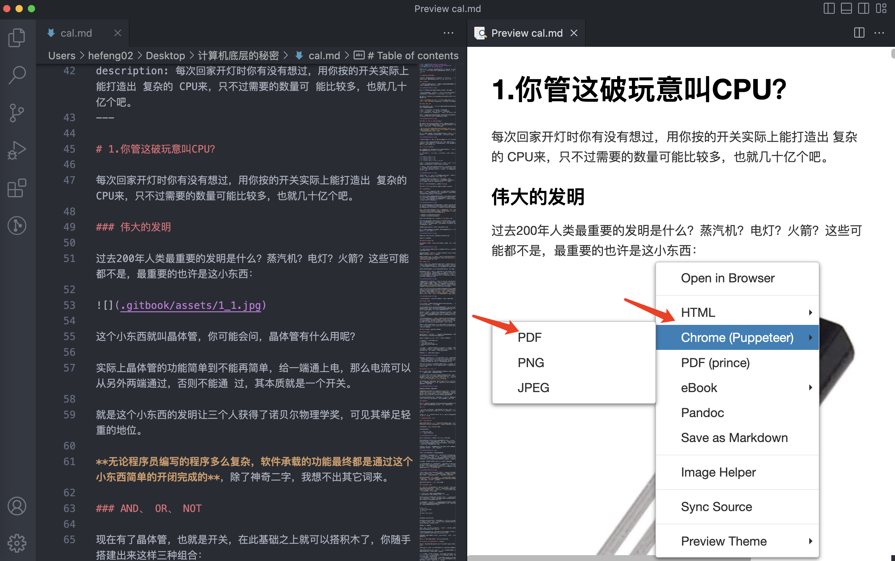

# 电子书制作


## markdown 转 pdf

环境：

- **Mac 电脑**
- **Visual Studio Code**


1、查看文件排序，不然合并的markdown文件是乱序的

```
ls *.md
```


文件命名建议数字位数一样，example：00，01


2、合并所有 markdown 文件

```
cat *.md > cal.md
```


3、安装 **Visual Studio Code **插件

- Markdown Preview Enhanced


4、通过Visual Studio Code 打开，合并的markdown的文件




5、预览markdown，右击，用浏览器打开




 Chrome 浏览器，command + p 打印，选择保存为pdf




6、通过 chrome（Puppeteer）预览 pdf，然后保存为 pdf

