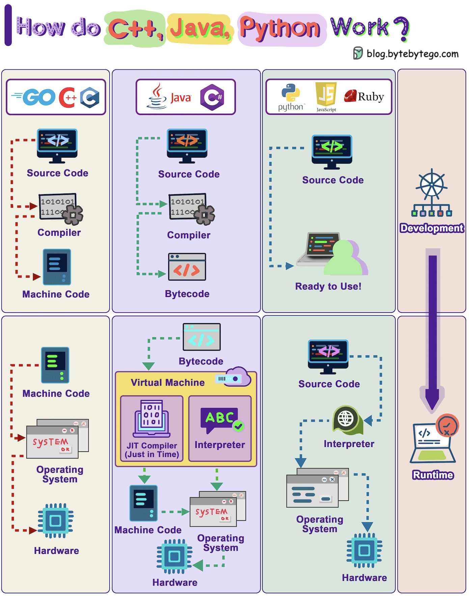

# How do C++，Java，Python work？

C++、Java 和 Python 如何运行？

我们刚刚制作了一个关于这个主题的视频。

 图中详细介绍了编译和执行的过程。

 使用编译器将源代码编译为机器代码的语言。此机器代码随后可以由 CPU 直接运行。例如：C、C++、Go。 相比之下，像 Java 这样的语言首先将源代码转换为字节码。然后 Java 虚拟机 (JVM) 运行该程序。有时，即时 (JIT) 编译器会将源代码转换为机器代码以提高执行速度。 Java 和 C# 就是一些示例。 

被解释的语言不经过编译。相反，它们的代码在执行期间由解释器处理。 Python、Javascript 和 Ruby 是一些示例。

 一般来说，编译语言比解释语言具有速度优势。 

在这里观看整个视频： [https://youtu.be/hnlz0YYCpBU](https://t.co/0iJzc2FOtM) 

